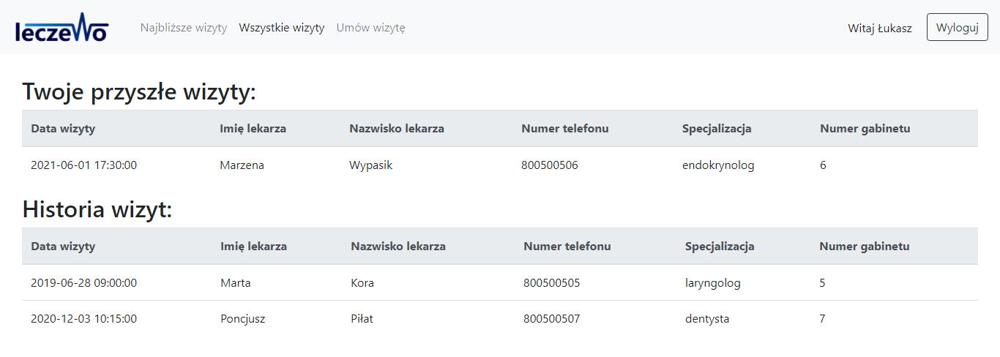
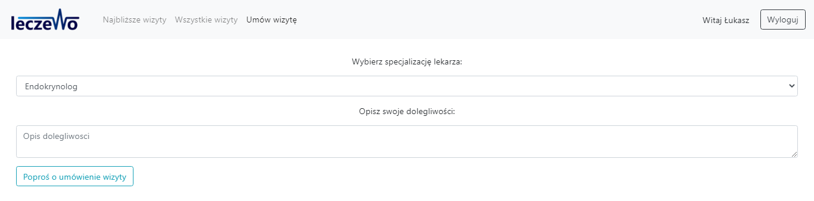
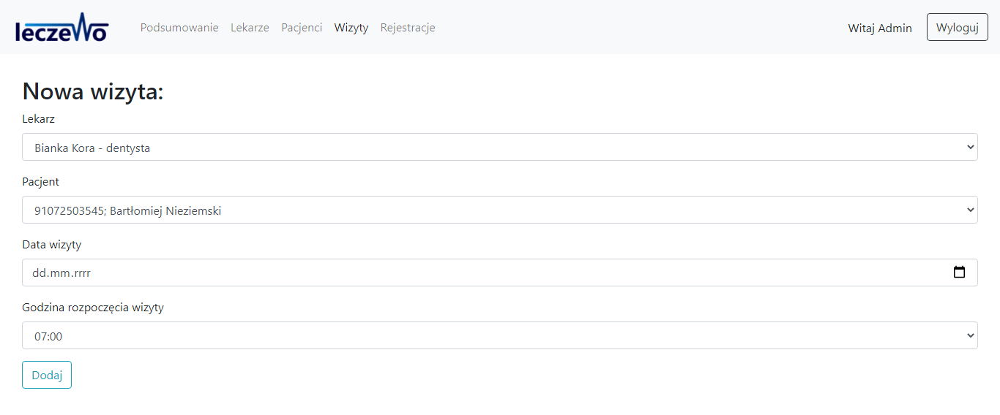
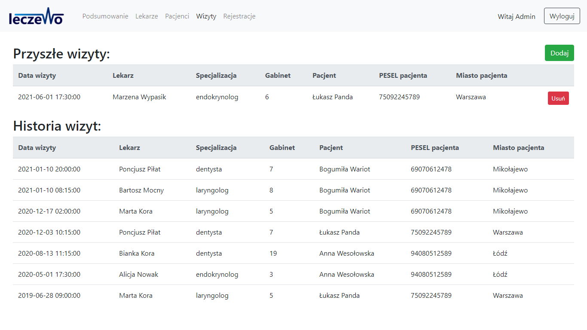
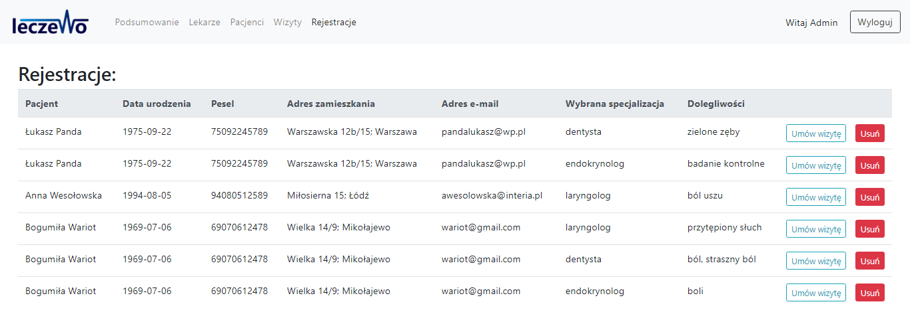

# Leczewo clinic - Przychodnia Leczewo


> The project was created for the Leczewo clinic.
> This application allows patients to request the
> visit online, without going out of their homes.
> It also improves administrators' work thanks to this
> main feature.

## Table of Contents

* [Technologies Used](#technologies-used)
* [Features](#features)
* [Setup](#setup)
  - [Production](#production)
    + [DB setup:](#db-setup-)
    + [Application setup:](#application-setup-)
  - [Development](#development)
* [Project Status](#project-status)
* [Room for Improvement](#room-for-improvement)
* [Contact](#contact)


## Technologies Used
* PHP Version 8.0.0 with extensions
* MariaDB 10.4.17
* XAMPP for Windows 8.0.0 for development


## Features
The main features from the patient's perspective are:

Future visits preview and visits history


Visit request


Main features from administrator's perspective are:

Managing visits




Responding to requests



## Setup

### Production

#### DB setup:
Create the database in MariaDB and the user for it.
Edit the file `sql/przychodnia_prod.sql` and change the administrator's username and password in line 41. Now you can export tables using this file and your favorite MariaDB manager.

#### Application setup:
To set up use the PHP server of your choice. This page can also be hosted using shared hosting.
Before running this application go to `utils/data_base.php`. Change DB configuration at the top of the file.

```
private $host = 'localhost';
private $user = 'root';
private $password = '';
private $dbname = 'przychodnia';
```


### Development
I recommend XAMPP with Apache and MariaDB for the
development purposes.

Clone the repository to XAMPP's htdocs path.
Run XAMPP Control Panel and run Apache and MySQL servers.
Now follow the instruction for a production setup,
but instead of `sql/przychodnia_prod.sql` use
`sql/przychodnia_dev.sql` file for the export. This
file contains some example data that will make the
development easier.


## Project Status
Complete


## Room for Improvement
Room for improvement:
* Interface improvements
* Mobile interfaces or mobile application


## Contact
Created by [@ewatryniszewska](https://github.com/ewatryniszewska) - feel free to contact me!
